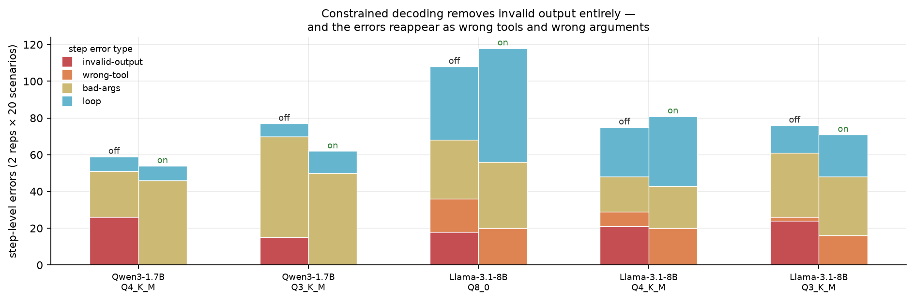
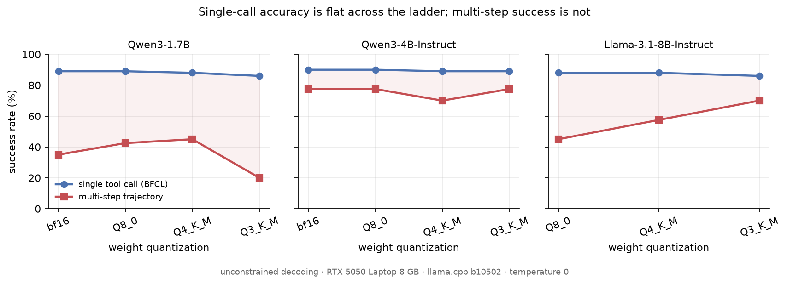
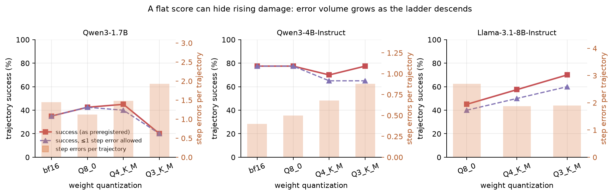
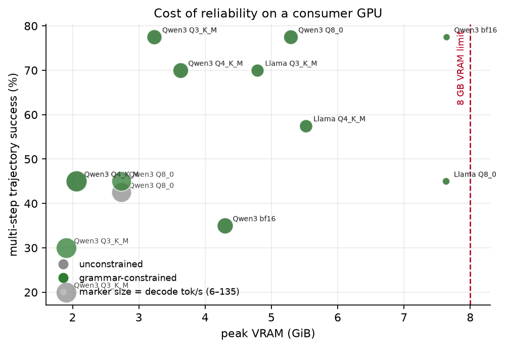

# QuantCliff

**Project period:** August 2026 · *Git history starts at publication (a single import commit); it does not reflect the working timeline.*

**Forcing a JSON schema on a quantized agent removes every malformed action and buys
almost no additional task success.** The errors do not disappear; they come back as wrong
tools and wrong arguments. Measured on a single 8 GB laptop GPU, across three models and
a bf16 → Q3_K_M quantization ladder.



Qwen3-1.7B, Qwen3-4B-Instruct and Llama-3.1-8B-Instruct as GGUF weights under llama.cpp
on an RTX 5050 Laptop (8 GB), temperature 0, 11 configurations × 2 decoding conditions.
Each configuration runs 100 single-call items from BFCL v4 and 20 multi-step agent
scenarios twice.

## Findings

**1. Constrained decoding eliminates the failure it targets, completely, and task
success barely moves.** Across the five configurations where malformed actions actually
occurred, JSON-schema-constrained decoding removed **104 of 104** `invalid-output`
events — every hallucinated tool name (`filter`, `map`, `json_query`, `calculate`) and
every unparseable action, down to zero in all five. Trajectory success changed by
**exactly +0.0 points in 9 of 11 configurations**. The one real gain was Qwen3-1.7B at
Q3_K_M, 20% → 30%. Throughput cost was ≤3%.

**2. The errors are substituted, not removed.** Where the grammar blocks the token the
model wanted, the model emits the nearest schema-valid alternative — and that alternative
is often wrong. On Llama-3.1-8B at Q3_K_M, `invalid-output` fell 24 → 0 while `wrong-tool`
rose **2 → 16**; at Q4_K_M, 21 → 0 while `wrong-tool` rose 8 → 20. On Qwen3-1.7B at
Q4_K_M, 26 → 0 while `bad-args` rose 25 → 46. **Total step-level error volume went up**
in two configurations (108 → 118 and 75 → 81). A schema validator at the API boundary
would report a clean run in every one of these cases.

Qwen3-4B is the control: it never emitted a malformed action at any precision, so the
grammar never bound, and its error volume is unchanged to the event
(16→17, 20→20, 27→27, 35→35).

**3. Single-call accuracy is blind to all of it.** BFCL accuracy moves 89% → 86% (1.7B),
90% → 89% (4B), 88% → 86% (8B) across the entire ladder, while multi-step success on the
same models spans 20–45%, 70–78% and 45–70%. A single-call benchmark would have declared
Q3_K_M safe on the model where two thirds of agent runs fail.



**4. A flat score can hide rising damage.** On Qwen3-4B, trajectory success is
78 / 78 / 70 / 78% down the ladder — essentially flat — while step-level errors per
trajectory climb monotonically 0.40 → 0.50 → 0.68 → 0.88. Permitting at most one step
error re-exposes the gap the raw score hides (78% → 65% at Q4_K_M and Q3_K_M). This
independently reproduces the masking effect reported by
[Flat Score, Amplified Failures](https://arxiv.org/abs/2607.27275) in a different
regime — smaller models, llama.cpp K-quants, consumer hardware — and is a reproduction,
not a new claim.



**5. The dominant failure is a confident wrong answer, not a broken one.**
`premature-stop` — announcing completion while the goal predicate is unmet — causes
15–20 of 40 failed runs on Qwen3-1.7B and 7–10 on Qwen3-4B. In one case the model booked
the cheapest flight rather than the cheapest *direct* flight, then reported a real
booking reference and a real shuttle confirmation. Every tool call succeeded and the
output was perfectly well-formed. `FAILURES.md` catalogues these with traces.

**6. On 8 GB, do not run a model that barely fits.** Qwen3-4B at bf16 (8.05 GB) reaches
78% success at **5.9 decode tok/s**; the same model at Q8_0 reaches the **same 78%** at
**57.8 tok/s** using 5.4 GB. Ten times the throughput for no measurable loss in agent
success. Llama-3.1-8B at Q8_0 (8.54 GB) shows the same collapse, 8.1 tok/s at 7.8 GB peak.



**7. An anomaly we cannot explain.** Llama-3.1-8B *improves* as it is compressed:
45% (Q8_0) → 57% (Q4_K_M) → 70% (Q3_K_M), driven by exactly five scenarios that Q8_0
fails and Q3_K_M passes. We report this as an open anomaly rather than a finding,
because **precision is confounded with memory pressure**: Q8_0 is the only 8B cell that
does not fit in 8 GB. It is not a harness artifact — zero server errors, zero truncated
generations, no step-budget exhaustion, near-deterministic runs. A post-hoc diagnostic
re-ran Q8_0 with the context window halved (8192 → 4096) and reproduced the outcome
counts **bit-for-bit** (T2 18/40 in both arms) with peak VRAM essentially unchanged
(7818 → 7827 MiB), so the KV-cache share of memory pressure is ruled out; the weights
themselves are the binding constraint (`DEVIATIONS.md` D5). What remains confounded is
precision versus weight-level memory pressure, which only a run on a larger GPU (or an
intermediate Q6_K cell) can separate. The anomaly stays open, and the 8B ordering is
reported but not interpreted.

## Results table

`grammar` = JSON-schema-constrained decoding. `err/traj` = step-level errors per
trajectory. `≤1` = success when at most one step error is permitted. All 11
configurations of the locked matrix completed; none was a DNF.

| model | quant | grammar | BFCL | trajectory | ≤1 | err/traj | recovery | tok/s | peak VRAM |
|---|---|---|---|---|---|---|---|---|---|
| Qwen3-1.7B | bf16 | off | 89% | 35% | 35% | 1.45 | 60% | 72.9 | 4402 MiB |
| Qwen3-1.7B | bf16 | on | 88% | 35% | 35% | 1.15 | 65% | 72.8 | 4402 MiB |
| Qwen3-1.7B | Q8_0 | off | 89% | 42% | 42% | 1.12 | 86% | 115.6 | 2798 MiB |
| Qwen3-1.7B | Q8_0 | on | 88% | 45% | 45% | 0.95 | 87% | 113.6 | 2798 MiB |
| Qwen3-1.7B | Q4_K_M | off | 88% | 45% | 40% | 1.48 | 81% | 135.1 | 2106 MiB |
| Qwen3-1.7B | Q4_K_M | on | 87% | 45% | 40% | 1.35 | 76% | 131.2 | 2106 MiB |
| Qwen3-1.7B | Q3_K_M | off | 86% | **20%** | 20% | 1.93 | 60% | 125.8 | 1948 MiB |
| Qwen3-1.7B | Q3_K_M | on | 86% | **30%** | 25% | 1.55 | 61% | 125.2 | 1948 MiB |
| Qwen3-4B | bf16 | off | 90% | 78% | 78% | 0.40 | 89% | **5.9** | 7822 MiB |
| Qwen3-4B | bf16 | on | 90% | 78% | 78% | 0.42 | 89% | **5.9** | 7822 MiB |
| Qwen3-4B | Q8_0 | off | 90% | 78% | 78% | 0.50 | 89% | 57.8 | 5414 MiB |
| Qwen3-4B | Q8_0 | on | 90% | 78% | 78% | 0.50 | 89% | 57.7 | 5414 MiB |
| Qwen3-4B | Q4_K_M | off | 89% | 70% | 65% | 0.68 | 89% | 68.1 | 3714 MiB |
| Qwen3-4B | Q4_K_M | on | 89% | 70% | 65% | 0.68 | 89% | 67.8 | 3714 MiB |
| Qwen3-4B | Q3_K_M | off | 89% | 78% | 65% | 0.88 | 90% | 63.0 | 3312 MiB |
| Qwen3-4B | Q3_K_M | on | 89% | 78% | 65% | 0.88 | 90% | 62.4 | 3312 MiB |
| Llama-3.1-8B | Q8_0 | off | 88% | 45% | 40% | 2.70 | 88% | **8.1** | 7818 MiB |
| Llama-3.1-8B | Q8_0 | on | 89% | 45% | 40% | 2.95 | 88% | **8.1** | 7818 MiB |
| Llama-3.1-8B | Q4_K_M | off | 88% | 57% | 50% | 1.88 | 91% | 46.9 | 5648 MiB |
| Llama-3.1-8B | Q4_K_M | on | 89% | 57% | 50% | 2.02 | 94% | 45.3 | 5648 MiB |
| Llama-3.1-8B | Q3_K_M | off | 86% | 70% | 60% | 1.90 | 97% | 44.3 | 4901 MiB |
| Llama-3.1-8B | Q3_K_M | on | 89% | 70% | 65% | 1.77 | 91% | 43.9 | 4901 MiB |

Per-item logs are in `results/raw/`, aggregates in `results/summary.csv`, and every
failed trajectory with its call trace in `results/failures.csv`.

## Reproduce

```bash
python harness/runner.py && python harness/aggregate.py && python harness/make_plots.py
```

Needs a llama.cpp `llama-server` binary in `tools/llama-cuda/` and GGUF weights in
`models/` (bartowski imatrix K-quants; exact filenames are in `harness/runner.py`).
`python harness/validate_scenarios.py` checks every scenario by replaying its oracle
solution. Add `--smoke` for a fast end-to-end check, or `--configs model:quant` for one
cell.

## What this does not show

- **The sample is small.** 20 scenarios per configuration. Each ran twice and the two
  runs are near-deterministic (0–1 divergences per configuration), so the repetitions
  confirm reproducibility but give **no error bars**. One scenario is 5 percentage
  points. Treat differences under ~10 points as unresolved — including the 1.7B
  bf16-vs-Q4 ordering, where Q4 scored *higher*, and the 4B Q4 dip. The +10 point
  grammar gain at 1.7B/Q3_K_M rests on 2 scenarios out of 20. Finding 1 is robust
  because it is a null result over 9 configurations; Finding 2 is robust because the
  substitution counts are event counts, not rates.
- **6 of the 20 scenarios carry no signal for these models.** Three were solved in every
  configuration, three failed in every configuration; roughly 14 do the work of
  separating configurations. `FAILURES.md` names them.
- **The scenarios are ours, not a community benchmark.** Deterministic mock environments
  written for this repository and validated only by oracle replay, not calibrated against
  human difficulty judgments.
- **One GPU, one runtime, one quantization pipeline.** RTX 5050 Laptop, llama.cpp b10502,
  bartowski imatrix K-quants. Results may not transfer to GPTQ/AWQ, other engines, or
  datacenter hardware; latency figures are specific to this laptop under Windows.
- **Weights only.** The KV cache stays at f16 throughout; KV and activation quantization
  are untested here.
- **A single action format.** Every model receives the same uniform JSON action schema
  rather than its native tool-call format, so the measured variable is quantization and
  decoding constraint rather than template plumbing. Models tuned for a specific native
  format may be disadvantaged.
- **`premature-stop` is partly a prompt property.** How readily a model stops depends on
  the system prompt, which was frozen before the sweep and not tuned per model.

## Relation to prior work

Compression and agents is not new ground, and this repository does not claim otherwise.

- [**ACBench**](https://arxiv.org/abs/2505.19433) (Dong et al., ICML 2025) benchmarks
  compression against agentic capability over 12 tasks and 15 models, finding 4-bit
  largely preserves tool use while degrading real-world application accuracy. Broader in
  models and tasks; uses GPTQ/AWQ rather than llama.cpp K-quants and does not report
  consumer-GPU systems metrics.
- [**Flat Score, Amplified Failures**](https://arxiv.org/abs/2607.27275) (Jang et al.,
  2026) has priority on the finding that quantization amplifies existing failure volume
  in multi-turn tool agents while task scores stay flat, and on the shrinking-budget
  diagnostic. Finding 4 reproduces that effect; it is not a new claim here. Their
  intervention was a prompt-level error repair — ours is decoding-level, which is where
  Findings 1 and 2 depart from them.
- [**Let Me Speak Freely?**](https://arxiv.org/abs/2408.02442) (Tam et al., EMNLP 2024)
  reports that format restrictions degrade reasoning. Finding 2 is a mechanism-level
  companion to that result: we see the distortion land specifically as wrong-tool and
  wrong-argument substitutions in agent trajectories.
- [**TinyLLM**](https://arxiv.org/abs/2511.22138) evaluates small edge models on
  BFCL-style single-call tool use, complementary to the multi-step axis here.
- [**BFCL**](https://github.com/ShishirPatil/gorilla) (Patil et al., ICML 2025) supplies
  the single-call items and the answer-matching semantics we re-implement.

The gap targeted here is the **interaction** between weight quantization and constrained
decoding — whether forcing a grammar rescues a compressed agent or merely tidies its
syntax. As far as we can find, that intersection had not been measured.

## Method

`EVAL_PLAN.md` was committed **before any experiment ran** (verifiable in git history).
It fixes the hypotheses, the experiment matrix, the metrics, the exclusion rules, and
what would falsify each hypothesis. Every departure from it is recorded in
`DEVIATIONS.md` — including a harness bug caught during the pre-sweep check, whose output
was deleted rather than patched, and the literature check that forced us to restate what
this work does not claim.

- **T1** — 100 BFCL v4 items (50 `simple`, 50 `multiple`) selected by upstream file
  order, scored by re-implementing BFCL's possible-answer matching.
- **T2** — 20 deterministic mock-tool scenarios, 3–7 dependent calls each, ≥2 distractor
  tools, and one injected transient tool error to measure recovery. Success is a
  rule-based goal predicate over final environment state. **No LLM judge produced any
  number in this repository.**
- **Failure taxonomy** — `invalid-output`, `wrong-tool`, `bad-args`, `loop`,
  `premature-stop`, fixed in advance.
- **Systems** — peak VRAM from 1 Hz `nvidia-smi` polling; decode tok/s and TTFT from
  llama.cpp per-call timings with the warmup call excluded.

## Layout

```
EVAL_PLAN.md        preregistered plan (committed before any run)
DEVIATIONS.md       every departure from it, dated
FAILURES.md         failure catalogue with real traces
harness/            runner, scorers, scenario engine, aggregation, plots
harness/scenarios/  20 scenario definitions (data, not code)
results/            per-item logs, summary.csv, failures.csv
plots/              the figures above
```

## License and citation

MIT; see `CITATION.cff`. Scenario definitions and harness are original. BFCL items are
used under the upstream dataset's Apache-2.0 license with attribution.
